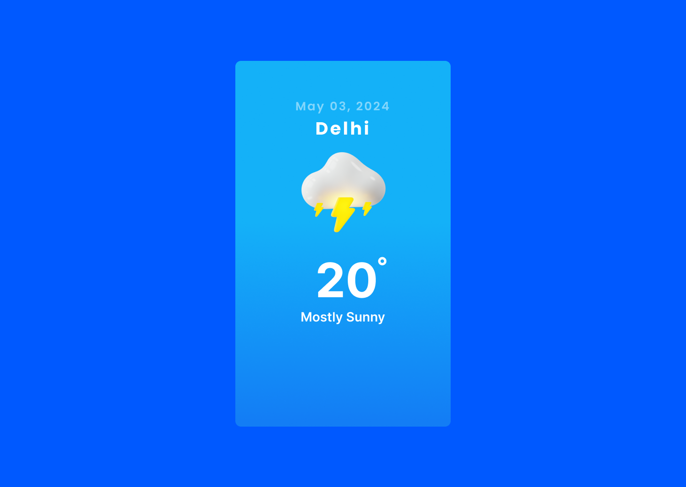

 
 

With [The Weather Forecasting](https://ziontutorial.com/) user can search locations by city name and observe the weather for the next 5-6 days and 3 hour interval.

The user of [The Weather Forecasting](https://ziontutorial.com/) tool can look for destinations by city name and view the weather forecast for the next three hours, five to six days out.
The app is created with material-UI and React.js.

 
The app is developed using React.js.

 

## 💻 Live Demo:

https://ziontutorial.com/

 

## ✨ Getting Started

- Make sure you already have `Node.js` and `npm` installed in your system.
- You need an API key from [OpenWeatherMap](https://openweathermap.org/). After creating an account, [grab your key](https://home.openweathermap.org/api_keys).

 

## ⚡ Install

- Clone the repository:

 @@ git clone https://github.com/Amin-Awinti/the-weather-forecasting.git

- Install the packages using the command `npm install`

 

## 📙 Used libraries

- `react-js`

Check `packages.json` for details

 

 
Thank You ☺